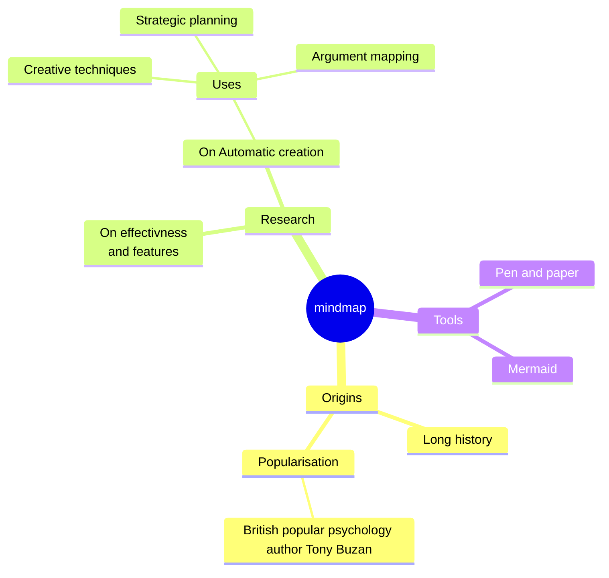

# Building a MindMap Using Python Classes

**Objective**: In this lab, you will learn how to define and implement classes in Python, and you will learn how to properly define the `__init__` and `__str__` special methods as well as write a recursive display method across two classes. You will work on a simple mind map application using two classes: `MindMapLeaf` and `MindMapComposite`. Along the way, you will organize your code into separate files and test class methods step by step.

A successful implementation of this lab will output text similar to this...
```text
mindmap
  root((mindmap))
    Origins
      Long history
      ::icon(fa fa-book)
      Popularisation
        British popular psychology author Tony Buzan
    Research
      On effectivness<br/>and features
      On Automatic creation
        Uses
            Creative techniques
            Strategic planning
            Argument mapping
    Tools
      Pen and paper
      Mermaid
```
...and when pasted into [Mermaid.Live](https://mermaid.live/edit) will generate a mindmap similar to this:

---

## Setup and Organization
1. **Create a new PyCharm Project** named `PyLab011` to organize your code.
2. **Inside this Project**, create two separate Python files:
   - `mindmap_leaf.py`
   - `mindmap_composite.py`

---

## Step 1: Creating the `MindMapLeaf` Class

### Task: Define the `MindMapLeaf` Class
1. **Open `mindmap_leaf.py`** and write the following class definition:
   ```python
   class MindMapLeaf:
       # Step 1: Write the __init__ method
       # - Define an __init__ method that takes two parameters: name and shape.
       # - Assign these parameters to the instance variables self.name and self.shape.
       ```

   **Hint**: Use `self.name = name` and `self.shape = shape` to assign attributes.

2. **Write the `__str__` Method**:
   - **Purpose**: This method should return the name of the leaf formatted with its shape.
   - **Instructions**:
     - Define a method named `__str__` that calls another method `get_shape_representation()`.
     - Use `format()` to insert `self.name` into the shape representation and return the formatted string.
   ```python
   # Step 2: Write the __str__ method
   # - Define __str__ that formats the name using get_shape_representation().
   ```

   **Hint**: `return shape_representation.format(self.name)`

3. **Write the `display` Method**:
   - **Purpose**: This method should print the formatted name with a specified level of indentation.
   - **Instructions**:
     - Define a method named `display` that takes an `indent` parameter (default value 0).
     - Use `" " * indent` to create the indentation and print the formatted name.
   ```python
   # Step 3: Write the display method
   # - Print the name with indentation using " " * indent + str(self).
   ```

4. **Write the `get_shape_representation` Method**:
   - **Purpose**: This method should return a string template based on the shape.
   - **Instructions**:
     - Define a dictionary named `shapes` inside `get_shape_representation`.
     - Use different symbols to represent shapes in your dictionary like `"circle": "(({}))"`, `"oval": "({})"`, `"square": "[{}]"`, `"cloud": "){}("`, `"hexagon": "{{{{{}}}}}"`, `"bang": ")){}(("`
     - Return the shape template using `shapes.get(self.shape, "{}")`.
   ```python
   # Step 4: Write the get_shape_representation method
   # - Create a shapes dictionary with shape templates.
   # - Use shapes.get to return the appropriate shape template.
   ```

### Testing `MindMapLeaf`
1. **Create a file** named `test_mindmap_leaf.py` and add code to test your class:
   ```python
   from mindmap_leaf import MindMapLeaf

   # Step 5: Create a MindMapLeaf object and test the __str__ and display methods.
   leaf = MindMapLeaf("Jean-Luc Picard", "circle")
   print(str(leaf))  # Should display "((Jean-Luc Picard))"
   leaf.display(2)   # Should display "  ((Jean-Luc Picard))" with two spaces

   print("MindMapLeaf tests completed!")
   ```

2. **Run `test_mindmap_leaf.py`** to check your implementation.

---

## Step 2: Creating the `MindMapComposite` Class

### Task: Define the `MindMapComposite` Class
1. **Open `mindmap_composite.py`** and start defining your class:
   ```python
   import os

   class MindMapComposite:
       # Step 1: Write the __init__ method
       # - Define an __init__ method that takes name and shape as parameters.
       # - Initialize self.name, self.shape, and an empty list self.children.
       ```

   **Hint**: Use `self.children = []` to initialize the list.

2. **Write the `add` and `remove` Methods**:
   - **Purpose**: Manage children of the composite node.
   - **Instructions**:
     - `add(child)`: Append the child to `self.children`.
     - `remove(child)`: Remove the child from `self.children`.
     - HINT: the `child` parameter is an object of type MindMapComposite or MindMapLeaf
   ```python
   # Step 2: Write the add and remove methods
   # - Use append() to add and remove() to delete from the children list.
   ```

3. **Write the `__str__` Method**:
   - **Purpose**: Similar to `MindMapLeaf`, but returns the composite’s name formatted with its shape.
   - **Instructions**:
     - Format `self.name` using `get_shape_representation()` and return the string.
   ```python
   # Step 3: Write the __str__ method
   # - Format the name using get_shape_representation() and return it.
   ```

4. **Write the `display` Method**:
   - **Purpose**: Print the formatted name and call `display` on all children.
   - **Instructions**:
     - Print the composite’s name with the specified indentation.
     - Use a loop to call `child.display(indent + 2)` for each child.
   ```python
   # Step 4: Write the display method
   # - Print the name with the specified indentation.
   # - Loop over each child and call display with increased indentation.
   ```

5. **Write the `get_shape_representation` Method**:
   - **Purpose**: Return the shape template from a dictionary, like in `MindMapLeaf`.
   - **Instructions**:
     - Define a dictionary with shape templates and return the template using `shapes.get()`.
     - HINT: This is the **SAME** as MindMapLeaf!
   ```python
   # Step 5: Write the get_shape_representation method
   # - Create a dictionary with shape templates.
   # - Use shapes.get to return the template.
   ```

### Testing `MindMapComposite`
1. **Create a file** named `test_mindmap_composite.py` and write code to test your class:
   ```python
   from mindmap_leaf import MindMapLeaf
   from mindmap_composite import MindMapComposite

   # Step 6: Create MindMapComposite and MindMapLeaf objects to test
   root = MindMapComposite("Root", "circle")
   leaf1 = MindMapLeaf("Child 1", "square")
   leaf2 = MindMapLeaf("Child 2", "cloud")
   root.add(leaf1)
   root.add(leaf2)

   print(str(root))  # Should display "((Root))"
   root.display()    # Should display root and its children

   print("MindMapComposite tests completed!")
   ```

2. **Run `test_mindmap_composite.py`** to verify your implementation.

---

## Step 3: Creating the Main Program

1. **Create a file** named `main.py` to display my mind map:
```python
#!/usr/bin/env python3
from mindmap_leaf import MindMapLeaf
from mindmap_composite import MindMapComposite

def main():
    if __name__ == "__main__":
        # Root of the mindmap
        root = MindMapComposite( "The Battle at Wolf 359", "circle" )

        characters = MindMapComposite( "Characters", "oval" )
        characters.add( MindMapLeaf( "Jean-Luc Picard / Locutus", "plain" ) )
        characters.add( MindMapLeaf( "William Riker", "plain" ) )
        characters.add( MindMapLeaf( "Data", "plain" ) )
        characters.add( MindMapLeaf( "Worf", "plain" ) )
        characters.add( MindMapLeaf( "Borg Queen (implied presence)", "plain" ) )
        root.add( characters )

        plot_points = MindMapComposite( "Plot Points", "square" )
        plot_points.add( MindMapLeaf( "Picard is assimilated by the Borg", "plain" ) )
        plot_points.add( MindMapLeaf( "Riker takes command of the Enterprise", "plain" ) )
        plot_points.add( MindMapLeaf( "The Federation fleet suffers heavy losses", "plain" ) )
        plot_points.add( MindMapLeaf( "Enterprise crew devises a plan to stop the Borg", "plain" ) )
        root.add( plot_points )

        themes = MindMapComposite( "Themes", "cloud" )
        themes.add( MindMapLeaf( "Identity and loss of self", "plain" ) )
        themes.add( MindMapLeaf( "Duty and leadership", "plain" ) )
        themes.add( MindMapLeaf( "Humanity vs. technology", "plain" ) )
        themes.add( MindMapLeaf( "Collectivism vs. individuality", "plain" ) )
        root.add( themes )

        setting = MindMapComposite( "Setting", "hexagon" )
        setting.add( MindMapLeaf( "USS Enterprise-D", "plain" ) )
        setting.add( MindMapLeaf( "Wolf 359 (space battle location)", "plain" ) )
        setting.add( MindMapLeaf( "Borg Cube", "plain" ) )
        setting.add( MindMapLeaf( "Starfleet Command (background communication)", "plain" ) )
        root.add( setting )

        conflicts = MindMapComposite( "Major Conflicts", "bang" )
        conflicts.add( MindMapLeaf( "Federation vs. Borg (existential threat)", "plain" ) )
        conflicts.add( MindMapLeaf( "Riker’s internal struggle as acting captain", "plain" ) )
        conflicts.add( MindMapLeaf( "Enterprise's fight to save Picard from assimilation", "plain" ) )
        root.add( conflicts )

        dialogue = MindMapComposite( "Dialogue Highlights", "oval" )
        dialogue.add( MindMapLeaf( "“I am Locutus of Borg. Resistance is futile.”", "plain" ) )
        dialogue.add( MindMapLeaf( "Riker: \"Mr. Worf, fire.\"", "plain" ) )
        dialogue.add( MindMapLeaf( "Guinan advising Riker on letting go of Picard", "plain" ) )
        root.add( dialogue )

        stage_directions = MindMapComposite( "Significant Stage Directions", "square" )
        stage_directions.add( MindMapLeaf( "Close-up of Picard’s face as Locutus", "plain" ) )
        stage_directions.add( MindMapLeaf( "Panoramic view of the devastated fleet at Wolf 359", "plain" ) )
        stage_directions.add( MindMapLeaf( "Enterprise maneuvering to evade the Borg", "plain" ) )
        stage_directions.add( MindMapLeaf( "Tense bridge scenes as the crew works together", "plain" ) )
        root.add( stage_directions )

        root.display()


if __name__ == "__main__":
    main()
```

2. **Run `main.py`** to see your my mindmap.
3. Modify or change this code to build **YOUR OWN UNIQUE MindMap**, maybe about how much you value this course! =;-)
4. Finally, take your mindmap output from your main.py program's console and see if you can get it to display in [Mermaid Live](https://mermaid.live/edit)
---

## Step 4: Submission
- Same as last week, the week before that, and the week before that.
- Upload your code to a GitHub Project
- Submit your GitHub Project link to Canvas for this assignment.
